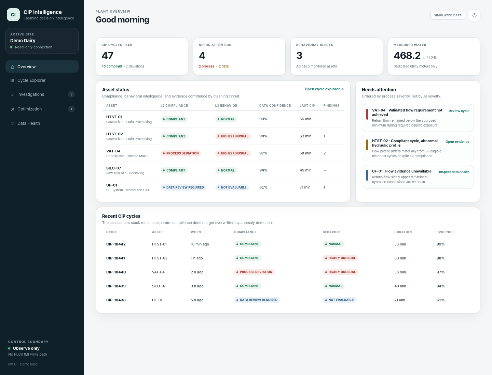
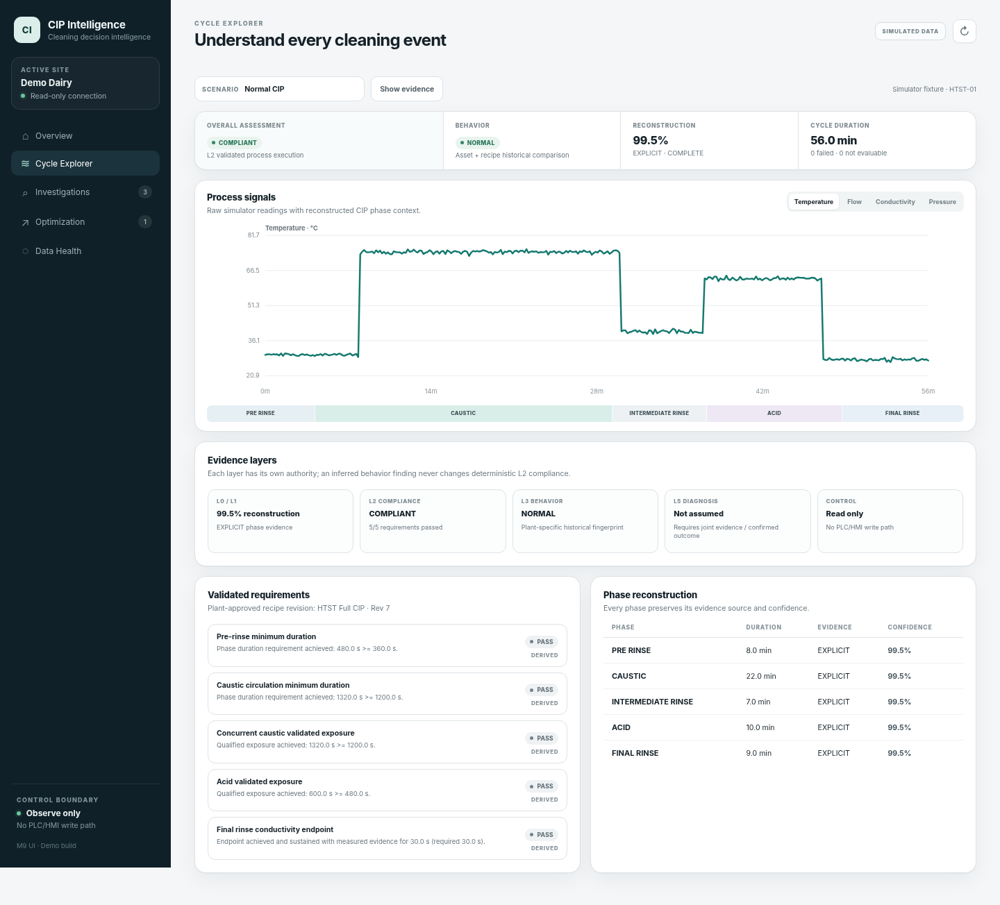

# CIP Intelligence

**Evidence-driven Cleaning-in-Place analytics for dairy and food manufacturing.**

[Live Demo](https://cip-intelligence.onrender.com/app/) · [Portfolio Case Study](docs/portfolio-case-study.md) · [Architecture](ARCHITECTURE.md) · [Validation Methodology](docs/validation-methodology.md) · [V1.1 Release Notes](RELEASE_NOTES_V1_1.md) · [V1.0 Release Notes](RELEASE_NOTES_V1.md)



## What problem does it solve?

CIP systems generate large amounts of process data, but determining whether a cleaning cycle actually followed the plant-approved procedure, whether the underlying measurements are trustworthy, what unusual behavior means, and where resources may be safely reduced can require fragmented manual investigation.

CIP Intelligence is a **read-only decision-intelligence layer** that turns those process records into traceable engineering evidence. It can ingest plant data, validate data quality, reconstruct CIP cycles, verify execution against plant-approved cleaning specifications, learn normal equipment behavior, compare multi-cycle historical trends, correlate production/QA/maintenance context, surface diagnostic evidence, quantify resource use, and identify controlled optimization opportunities.

It does **not** control the plant. PLC/HMI systems remain responsible for CIP control and interlocks.

## At a glance

`Plant data → L0 Data Trust → L1 Reconstruction → L2 Validated Compliance → L3 Behavioral Intelligence → Historical Trend Context → L4 Production Context → L5 Diagnostics → L6 Controlled Optimization`

| Layer | Question CIP Intelligence answers |
| --- | --- |
| **L0 — Data Trust** | Can the sensor and acquisition evidence be trusted? |
| **L1 — CIP Reconstruction** | What cleaning cycle and phases actually occurred? |
| **L2 — Validated Process Compliance** | Did available evidence show the plant-approved CIP procedure was executed as specified? |
| **L3 — Behavioral Intelligence** | Was the cycle unusual for this asset and recipe revision even if it remained compliant? |
| **Historical trend context** | Which assets are drifting, accumulating deviations, or using more time/resources across repeated cycles? |
| **L4 — Production Context** | What production conditions preceded the CIP, and is the response contextually unusual? |
| **L5 — Outcome & Diagnostic Intelligence** | What do process, QA, maintenance, and operator evidence collectively suggest? |
| **L6 — Controlled Optimization Intelligence** | Is there evidence for a controlled engineering/QA trial that could reduce excess time or resources? |

## V1.0 proof point

**2,240 synthetic CIP cycles · 4 simulated HTST circuits · 124/124 automated regression tests passing at the V1.0 release.**

These are **synthetic known-answer regression results, not real-plant accuracy claims**. The V1.0 release established the deterministic analysis ladder and safety boundaries; V1.1 adds historical trend intelligence and continuous CI without changing those claims.

## Safety boundary

CIP Intelligence can determine whether available process evidence indicates that a **plant-defined/validated CIP process was executed as specified**. Process measurements alone do not prove microbiological cleanliness or authorize sanitation release.

The platform is deliberately read-only:

- no PLC/HMI command path
- no automatic recipe changes
- no automatic sanitation release
- no replacement for plant engineering, QA, validation, or formal change control
- optimization outputs remain controlled-validation candidates requiring human review
- historical attention scores prioritize investigation only and never override L2 compliance

## Product rule

**Evidence before AI. Reliability before cleverness.**

The platform is designed around deterministic evidence and explicit lineage first. Statistical or learned behavior is used to add context, not to override validated plant requirements.

## Product UI



The browser UI includes **Plant Overview, Cycle Explorer, Historical Intelligence, Investigations, Controlled Optimization, and Data Health** screens. Simulator-backed presentation data lets the public portfolio demo be explored without proprietary plant information.

### V1.1 Historical Intelligence

V1.1 adds 30 / 60 / 90-day deterministic synthetic history across five demo assets. The historical screen ranks assets for engineering review using transparent evidence such as flow drift, temperature drift, cycle-duration drift, water-use trend, repeated process deviations, behavioral alerts, and data-review events.

The ranking is deliberately advisory. It is intended to answer **“where should an engineer investigate first?”**, not to change a validated recipe or redefine whether a CIP cycle complied with its approved requirements.

## Core capabilities

- universal CIP semantic model with physical-tag identity and redundant-sensor support
- conservative CSV inspection, explicit semantic mapping, unit normalization, plant timezone handling, and source lineage
- read-only watched-folder acquisition plus adapter interfaces for future historian/database/API/OPC UA connectors
- automatic asset-specific CIP cycle reconstruction from explicit sequence evidence or conservative sensor inference
- deterministic `PASS` / `FAIL` / `NOT_EVALUABLE` L2 compliance against versioned plant-approved specifications
- simultaneous exposure calculations across temperature, flow, chemistry, and other configured requirements
- data-quality gating that distinguishes a process deviation from an inability to prove compliance
- asset- and recipe-specific robust behavioral baselines with `NORMAL` / `UNUSUAL` / `HIGHLY_UNUSUAL` outcomes
- deterministic 30 / 60 / 90-day historical trend analysis with transparent asset attention ranking
- dedicated utility/resource accounting separated from recirculating process flow
- plant-configured economics with no built-in industry cost assumptions
- production-context reconstruction and comparable-history analysis without inventing a universal soil-load score
- QA, maintenance, operator-observation, and diagnostic evidence stores with explicit separation of hypotheses from confirmed conditions
- controlled final-rinse optimization candidates gated by compliance, endpoint evidence, historical behavior, QA outcomes, and diagnostic status
- immutable/versioned analysis artifacts and lineage across the intelligence ladder
- GitHub Actions CI for the Python regression suite and Historical Intelligence JavaScript syntax validation

For the detailed engineering implementation, see [ARCHITECTURE.md](ARCHITECTURE.md) and the milestone documents under [`docs/`](docs/).

## Run locally

```bash
cd services/api
python -m venv .venv
source .venv/bin/activate  # Windows: .venv\Scripts\activate
pip install -r requirements.txt
uvicorn app.main:app --reload
```

Then open:

- Product UI: `http://127.0.0.1:8000/app/`
- API docs: `http://127.0.0.1:8000/docs`

The UI is served by the same FastAPI process, so the project runs without a separate frontend build.

## Explore the demo

### Ingestion

Use `data/messy_historian_export.csv` with `config/messy_demo_mapping.json`:

1. `POST /v1/ingestion/inspect` — inspect a CSV and receive mapping suggestions.
2. `POST /v1/mappings` — explicitly save an approved mapping.
3. `POST /v1/ingestion/{profile_name}` — preserve and normalize the source data.

### CIP reconstruction

After normalized ingestion exists, call `POST /v1/reconstruction/ingestions/{ingestion_id}`. For the deterministic simulator, compare `GET /v1/demo/reconstruct/normal?mode=explicit` with `GET /v1/demo/reconstruct/normal?mode=inferred`. Inferred reconstruction is intentionally lower-confidence even when it finds the same known sequence.

### Validated compliance

`config/example_htst_validated_recipe_v7.json` is a **simulation fixture, not a universal CIP recommendation**. Real deployments must load the plant's approved validation specification.

Try `GET /v1/demo/compliance/normal`, `.../low_temp`, `.../low_flow`, `.../sensor_freeze`, and `.../excessive_rinse`.

### Behavioral intelligence

L3 requires an immutable baseline from historical cycles for the **same asset and recipe revision**. The default policy requires at least 20 eligible L2-compliant cycles and screens gross compliant outliers before freezing the baseline.

Try `GET /v1/demo/behavior/normal`, `.../compliant_low_flow`, `.../profile_shift`, `.../excessive_rinse`, `.../low_temp`, and `.../sensor_freeze`. A cycle may remain L2-compliant while L3 reports historically unusual behavior.

### Historical intelligence

The V1.1 public UI uses a deterministic known-answer historical fixture generated from `app/historical.py`. The 30 / 60 / 90-day summaries are served with the application from `/app/historical-data.json` and are regression-tested against the Python engine so the UI fixture cannot silently drift away from the analysis logic.

The simulator intentionally contains stable assets plus hydraulic drift, temperature deterioration, increasing cycle duration/water use, and explicit data-quality review events. Fixture-specific thresholds are **not universal CIP recommendations**.

### Resource & economics intelligence

Resource accounting uses **dedicated utility meters/signals**; return-flow circulation is never treated as fresh-water use. Plant-specific rates are stored separately, and bundled simulator rates are not industry benchmarks.

Compare `GET /v1/demo/economics/normal` with `GET /v1/demo/economics/excessive_rinse`.

### Production-context intelligence

Production-run evidence can come from MES/historian/database/API/CSV/manual/simulator sources. L4 reconstructs the contiguous uncleaned production campaign preceding a CIP and compares it with relevant historical context without claiming causation.

Compare `GET /v1/demo/context/long_run_response` with `GET /v1/demo/context/unexpected_after_short_run`.

### Outcome & diagnostic intelligence

L5 links process evidence with QA results, maintenance findings, operator observations, and resolved cases. It intentionally refuses to infer hydraulic restriction from low flow alone; plant-specific joint evidence or physical confirmation is required.

Try `GET /v1/demo/diagnostics/verification_failure`, `.../restriction_confirmed`, `.../sensor_freeze`, and `.../normal`.

### Controlled optimization intelligence

L6 converts prior evidence into a **controlled-validation candidate**, never an automatic recipe change. `GET /v1/demo/optimization/excessive_rinse` demonstrates a final-rinse endpoint reached well before phase completion and proposes a conservative trial envelope while keeping the approved endpoint authoritative.

Even a successful controlled trial only supports human review; formal recipe adoption remains a plant engineering/QA/change-control decision.

## Validation and release documentation

- [V1.1 Historical Intelligence release notes](RELEASE_NOTES_V1_1.md)
- [V1.0 release notes](RELEASE_NOTES_V1.md)
- [Validation methodology](docs/validation-methodology.md)
- [Portfolio case study](docs/portfolio-case-study.md)
- [Real-plant pilot plan](docs/real-plant-pilot-plan.md)
- [M11 validation release](docs/milestone-11-validation-release.md)

## Current status

CIP Intelligence V1.1 is a **portfolio-complete, simulator-backed demonstration** of the full V1 evidence ladder plus historical trend intelligence. The software remains read-only and the public data remains synthetic. The next meaningful engineering milestone is offline validation against anonymized historical plant data before making any real-world performance claims.
